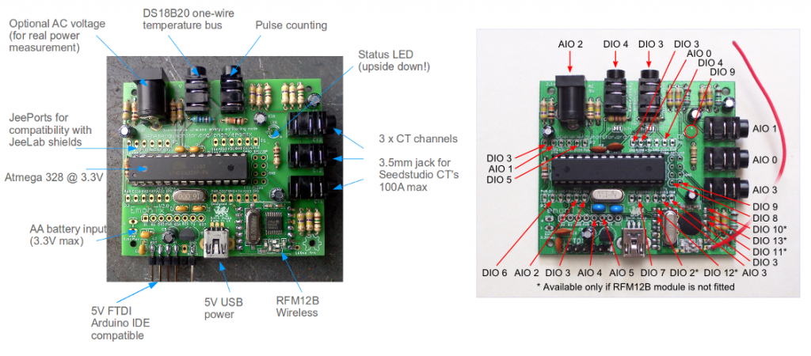
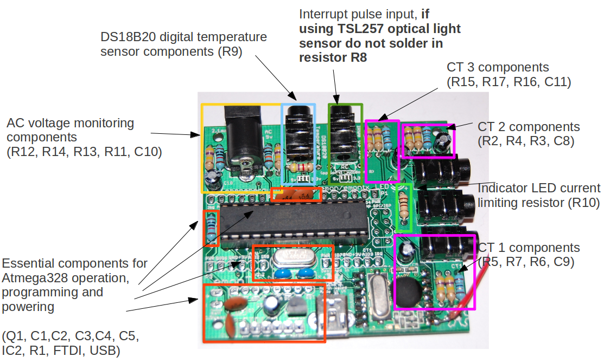
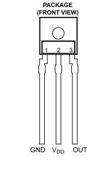
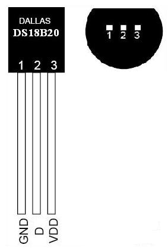

# emontx2
emonTx V2 (through-hole design)

**emonTx V2 has been superseded by the [emonTx V3](https://github.com/openenergymonitor/emontx3)**

***

A low power, wireless energy monitoring node, the EmonTx is designed to sense data from multiple CT sensors, optical pulses from a utility meter and from multiple one-wire temperature sensors. It can be powered by 2 AA batteries or 5V at the USB connector.  Features and hardware details.

The emonTx is based on the Atmega328 8-bit microcontroller and is fully compatible with the Arduino IDE. A 5V FTDI to USB cable is required for programming.

## [emonTx V2 Build Guide](buildguide.md)

## Features

- Based on JeeNodeV5 design - many thanks to Jean-Claude Wippler for sharing his great work
- Compatible with most JeeNode shields
- Designed to run on 3.3V and be powered by 2x AA batteries
- Designed to fit in this case
- Uses 3.5mm jack plug connections
- Can be powered using 5V via the mini-USB connector
- Requires FTDI cable for programming

## Energy Monitoring

- 3 x CT monitoring channels - based on OpenEnergyMonitor design using seedstudio 100A max CT's SCT-013-000
- 1 x AC 9v input - (optional) for real power measurements see AC non-invasive for more details
- 1x pulse counting input for interfacing directly or optically (using TSL257 Light to Voltage sensor) with pulse output utility meters. Do not fit 10K resistor R8 if using TSL257 optical sensor to detect pulses.
or
- pulse input can be used with TSL261R IR for reading output from IrDA meter

*Note: the resistor R8 should be omitted when using the TSL257 optical sensor to detect pulses from a pulse output meter.*

## Temperature

- Supports multiple DS18B20 digital temperature sensors on a one-wire bus. Potentially up to 16; limited by wireless data packet size.

### Jack plug connections

## Wireless

- Uses Hope Alpha RF / RFM12B Transceiver. Frequencies available include: ISM band 433Mhz (All countries), 868Mhz (Europe only), or 915 MHz (US and Australia only). The OpenEnergyMonitor kit includes the option of a 433Mhz or 868Mhz module.
- Up to 30 emonTxs can communicate with one emonBase station
- Potential for 250 different network groups set up in a single location

## Power

The emonTx is designed to be powered by 2 x AA batteries or by 5v USB/FTDI. When powering the unit with 5V through the USB or FTDI header the on-board voltage regulator will reduce the voltage to 3.3V. The battery connection header is not regulated, therefore the max voltage at the battery header should should not exceed 3.3 Volts. If higher voltage is connected, the RFM12 is at risk of damage. The RFM12 can be operated at 5V, but that exceeds the recommended maximum.

emonTx was designed to consume as little power as possible. (Low power optimisation details are here) Much of the power optimisation can be done via software, e.g. putting the Atmega and RF12 to sleep when practical to do so. The following measurements were taken with two CT channels connected, but the software was reading from only one channel:

- 0.1mA @ 3.13V =  0.31mW when Atmega and RF12 in sleep mode
- 6.7mA @ 3.13V = 21mW when ATmega is awake and RF12 is in sleep mode
- 7.14mA @ 3.13V = 22.35mW when ATmega and RF12 are awake but not transmitting
- 14mA (approx) @ 3.13V = 43.8mW when RF12 is transmitting - max power

## Physical dimensions

- Case: 102.8 mm x 61 mm
- PCB: 63.3 mm x 56 mm

The design is based on the JeeNode. It's fully open-source and is designed for easy expandability and compatibility with JeeLabs plug-shields.

[Open-source design on ThingiVerse](http://www.thingiverse.com/thing:65855)

