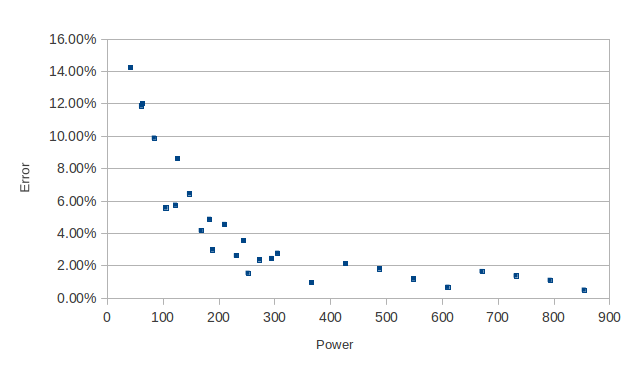

# emonTx V2 Accuracy Test

### Summary

_The test detailed below performed on one emontx comes to the following conclusion:_

_The error below 40W could not be measured reliably and below 100W it was worse than 10%. Above 100W it was better than 10%, above 150W better than 6%, above 250W better than 4% and above 500W better than 2%._

It may be that your emontx will surpass or fail to achieve these accuracy levels depending on:

1) Calibration - as demonstrated in this test, it may be necessary to apply an additional calibration, the precision of the different components in the circuit means that the voltage calibration can be anywhere between  203.1 – 265.4 while the current sensor calibration can be anywhere between 109.44 – 112.78see [CT and AC power adapter installation and calibration theory](https://learn.openenergymonitor.org/electricity-monitoring/ctac/calibration)

2) Bias position will have a large effect on accuracy at low powers see: [https://learn.openenergymonitor.org/electricity-monitoring/ct-sensors/measurement-implications-of-adc-resolution-at-low-current-values](https://learn.openenergymonitor.org/electricity-monitoring/ct-sensors/measurement-implications-of-adc-resolution-at-low-current-values)

3) Level of electro-magnetic interference in your environment. Some laptops and switch mode power supplies can be a large source of electro-magnetic interference. Whether your circuit is shielded in any way i.e inside a metal box. A certain level of noise is actually a good thing as it helps overcome the limitations of trying to measure power where the current waveform is close to the ADC level magnitude, by causing the levels to flip higher and lower which after averaging gives a more accurate result.

If you could also repeat this test and post up your results, it would be great to get some comparative data of different emontx's in real world use.

If your also a non-emontx user but have build the emontx circuit on a breadboard, stripboard or arduino shield protoboard it would also be interesting to compare results.

### Test setup

The test setup consists of an emontx with the standard Mascot AC-AC voltage adapter for voltage measurement and the standard current sensor, a YHDC sct-013-000 CT. The emonTx is powered via a 5 V USB power supply. The EmonTx sends the realpower values wirelessly to a jeelink that is connected to the computer.

The normal emonTx_CT123_Voltage sketch was used, the measurement rate was increased from once every 5 seconds to twice a second.

The CT is clipped around a modified cable that goes to a fixed load (a 20W and 60W incandescent lightbulb was used in the test). The cable modification was to separate the live and neutral wires and getting enough cable length to wrap around the CT up to 14 times in the case of this test.

A 20W and 60W incandescent lightbulb was used to ensure that the current waveform would be a near-sinusoidal waveform. It is expected that a low energy lightbulb may show higher accuracy at lower powers as its non-linear current draw, a current draw that looks more like a spike at the peak of the mains voltage waveform will utilise more ADC levels, see [Measurement implications of ADC resolution at low current values](https://learn.openenergymonitor.org/electricity-monitoring/ct-sensors/measurement-implications-of-adc-resolution-at-low-current-values).

### Test procedure

The test was performed in two parts: first 1-14 turns with a 20W lightbulb and second 1-14 turns with a 60W lightbulb. Care was taken each time to make sure that the CT was clipped firmly, that the contact between the split cores where good and that there was no observable effect in trying to push the cores closer together - indicating good contact.

The measurements were logged to a text file and opened and graphed in realtime using KST, an open source data viewing program. KST was set to a data range of 20 datapoints and a label was created to show the Min, Max, Mean and Standard deviation (Sigma) of the power data.

20 datapoints at 2 datapoints a second covers a time window of 10 seconds for each Min, Max, Mean and Standard deviation measurement. Care was taken to make sure that the mains voltage did not vary significantly during the sample duration.

**Min:** the minimum power value in the sample of 20 datapoints.

**Max:** the maximum power value in the sample of 20 datapoints.

**Mean:** the mean value of the 20 datapoints.

**Standard deviation:** the [standard deviation](https://en.wikipedia.org/wiki/Standard_deviation) of the 20 datapoints

These values where logged alongside the actual power as given by the plug meter multiplied by the number of turns in a spreadsheet.

### Uncalibrated ResultsÂ

These are the raw results, its clear that there is a significant calibration error as the error appears to increase in a particular direction linearly:

**The plug in meter column** on the left shows the number of watts as measured on the plug in meter: 21W relates to the actual power consumption of the 20W incandescent lightbulb, 60W relates to the actual power consumption of the 60W lightbulb.

**The number of turn column** is the number of turns of the live or neutral wire in the CT. The number of turns multiplied by the plug in meter power gives the power (or actually current) level as seen by the CT.

<table border="0" cellspacing="0" cols="12" frame="VOID" rules="NONE"><colgroup><col width="103"></colgroup> <colgroup><col width="80"></colgroup> <colgroup><col width="72"></colgroup> <colgroup><col width="77"></colgroup> <colgroup><col width="86"></colgroup> <colgroup><col width="86"></colgroup> <colgroup><col width="86"></colgroup> <colgroup><col width="86"></colgroup> <colgroup><col width="86"></colgroup> <colgroup><col width="86"></colgroup> <colgroup><col width="86"></colgroup> <colgroup><col width="95"></colgroup>

<tbody>

<tr>

<td align="CENTER" height="17" width="103">**plug in meter**</td>

<td align="CENTER" width="80">**no of turns**</td>

<td align="CENTER" width="72">**CT power**</td>

<td align="CENTER" bgcolor="#E6E6FF" width="77">**Max (A)**</td>

<td align="CENTER" bgcolor="#E6E6FF" width="86">**Min (B)**</td>

<td align="CENTER" bgcolor="#E6E6FF" width="86">**Mean**</td>

<td align="CENTER" bgcolor="#E6E6FF" width="86">**Standard Deviation**</td>

<td align="CENTER" width="86">**error (A)**</td>

<td align="CENTER" width="86">**error (B)**</td>

<td align="CENTER" width="86">**% error (A)**</td>

<td align="CENTER" width="86">**% error (B)**</td>

<td align="CENTER" bgcolor="#E6E6FF" width="95">**MAX % error**</td>

</tr>

<tr>

<td align="CENTER" height="17" sdnum="2057;" sdval="21">21</td>

<td align="CENTER" sdnum="2057;" sdval="1">1</td>

<td align="CENTER" sdnum="2057;" sdval="21">21</td>

<td align="CENTER" bgcolor="#E6E6FF" sdnum="2057;" sdval="30">30</td>

<td align="CENTER" bgcolor="#E6E6FF" sdnum="2057;" sdval="10">10</td>

<td align="CENTER" bgcolor="#E6E6FF" sdnum="2057;" sdval="21.8">21.8</td>

<td align="CENTER" bgcolor="#E6E6FF" sdnum="2057;" sdval="5.4">5.4</td>

<td align="CENTER" sdnum="2057;" sdval="9">9</td>

<td align="CENTER" sdnum="2057;" sdval="11">11</td>

<td align="CENTER" sdnum="2057;0;0.00%" sdval="0.428571428571429">42.86%</td>

<td align="CENTER" sdnum="2057;0;0.00%" sdval="0.523809523809524">52.38%</td>

<td align="CENTER" bgcolor="#E6E6FF" sdnum="2057;0;0.00%" sdval="0.523809523809524">52.38%</td>

</tr>

<tr>

<td align="CENTER" height="17" sdnum="2057;" sdval="21">21</td>

<td align="CENTER" sdnum="2057;" sdval="2">2</td>

<td align="CENTER" sdnum="2057;" sdval="42">42</td>

<td align="CENTER" bgcolor="#E6E6FF" sdnum="2057;" sdval="45">45</td>

<td align="CENTER" bgcolor="#E6E6FF" sdnum="2057;" sdval="36">36</td>

<td align="CENTER" bgcolor="#E6E6FF" sdnum="2057;" sdval="39">39</td>

<td align="CENTER" bgcolor="#E6E6FF" sdnum="2057;" sdval="3">3</td>

<td align="CENTER" sdnum="2057;" sdval="3">3</td>

<td align="CENTER" sdnum="2057;" sdval="6">6</td>

<td align="CENTER" sdnum="2057;0;0.00%" sdval="0.0714285714285714">7.14%</td>

<td align="CENTER" sdnum="2057;0;0.00%" sdval="0.142857142857143">14.29%</td>

<td align="CENTER" bgcolor="#E6E6FF" sdnum="2057;0;0.00%" sdval="0.142857142857143">14.29%</td>

</tr>

<tr>

<td align="CENTER" height="17" sdnum="2057;" sdval="21">21</td>

<td align="CENTER" sdnum="2057;" sdval="3">3</td>

<td align="CENTER" sdnum="2057;" sdval="63">63</td>

<td align="CENTER" bgcolor="#E6E6FF" sdnum="2057;" sdval="63">63</td>

<td align="CENTER" bgcolor="#E6E6FF" sdnum="2057;" sdval="52">52</td>

<td align="CENTER" bgcolor="#E6E6FF" sdnum="2057;" sdval="60">60</td>

<td align="CENTER" bgcolor="#E6E6FF" sdnum="2057;" sdval="3.3">3.3</td>

<td align="CENTER" sdnum="2057;" sdval="0">0</td>

<td align="CENTER" sdnum="2057;" sdval="11">11</td>

<td align="CENTER" sdnum="2057;0;0.00%" sdval="0">0.00%</td>

<td align="CENTER" sdnum="2057;0;0.00%" sdval="0.174603174603175">17.46%</td>

<td align="CENTER" bgcolor="#E6E6FF" sdnum="2057;0;0.00%" sdval="0.174603174603175">17.46%</td>

</tr>

<tr>

<td align="CENTER" height="17" sdnum="2057;" sdval="21">21</td>

<td align="CENTER" sdnum="2057;" sdval="4">4</td>

<td align="CENTER" sdnum="2057;" sdval="84">84</td>

<td align="CENTER" bgcolor="#E6E6FF" sdnum="2057;" sdval="83">83</td>

<td align="CENTER" bgcolor="#E6E6FF" sdnum="2057;" sdval="71">71</td>

<td align="CENTER" bgcolor="#E6E6FF" sdnum="2057;" sdval="78">78</td>

<td align="CENTER" bgcolor="#E6E6FF" sdnum="2057;" sdval="4">4</td>

<td align="CENTER" sdnum="2057;" sdval="-1">-1</td>

<td align="CENTER" sdnum="2057;" sdval="13">13</td>

<td align="CENTER" sdnum="2057;0;0.00%" sdval="-0.0119047619047619">-1.19%</td>

<td align="CENTER" sdnum="2057;0;0.00%" sdval="0.154761904761905">15.48%</td>

<td align="CENTER" bgcolor="#E6E6FF" sdnum="2057;0;0.00%" sdval="0.154761904761905">15.48%</td>

</tr>

<tr>

<td align="CENTER" height="17" sdnum="2057;" sdval="21">21</td>

<td align="CENTER" sdnum="2057;" sdval="5">5</td>

<td align="CENTER" sdnum="2057;" sdval="105">105</td>

<td align="CENTER" bgcolor="#E6E6FF" sdnum="2057;" sdval="99">99</td>

<td align="CENTER" bgcolor="#E6E6FF" sdnum="2057;" sdval="93">93</td>

<td align="CENTER" bgcolor="#E6E6FF" sdnum="2057;" sdval="96">96</td>

<td align="CENTER" bgcolor="#E6E6FF" sdnum="2057;" sdval="1.3">1.3</td>

<td align="CENTER" sdnum="2057;" sdval="-6">-6</td>

<td align="CENTER" sdnum="2057;" sdval="12">12</td>

<td align="CENTER" sdnum="2057;0;0.00%" sdval="-0.0571428571428571">-5.71%</td>

<td align="CENTER" sdnum="2057;0;0.00%" sdval="0.114285714285714">11.43%</td>

<td align="CENTER" bgcolor="#E6E6FF" sdnum="2057;0;0.00%" sdval="0.114285714285714">11.43%</td>

</tr>

<tr>

<td align="CENTER" height="17" sdnum="2057;" sdval="21">21</td>

<td align="CENTER" sdnum="2057;" sdval="6">6</td>

<td align="CENTER" sdnum="2057;" sdval="126">126</td>

<td align="CENTER" bgcolor="#E6E6FF" sdnum="2057;" sdval="119">119</td>

<td align="CENTER" bgcolor="#E6E6FF" sdnum="2057;" sdval="108">108</td>

<td align="CENTER" bgcolor="#E6E6FF" sdnum="2057;" sdval="116">116</td>

<td align="CENTER" bgcolor="#E6E6FF" sdnum="2057;" sdval="2.8">2.8</td>

<td align="CENTER" sdnum="2057;" sdval="-7">-7</td>

<td align="CENTER" sdnum="2057;" sdval="18">18</td>

<td align="CENTER" sdnum="2057;0;0.00%" sdval="-0.0555555555555556">-5.56%</td>

<td align="CENTER" sdnum="2057;0;0.00%" sdval="0.142857142857143">14.29%</td>

<td align="CENTER" bgcolor="#E6E6FF" sdnum="2057;0;0.00%" sdval="0.142857142857143">14.29%</td>

</tr>

<tr>

<td align="CENTER" height="17" sdnum="2057;" sdval="21">21</td>

<td align="CENTER" sdnum="2057;" sdval="7">7</td>

<td align="CENTER" sdnum="2057;" sdval="147">147</td>

<td align="CENTER" bgcolor="#E6E6FF" sdnum="2057;" sdval="137">137</td>

<td align="CENTER" bgcolor="#E6E6FF" sdnum="2057;" sdval="129">129</td>

<td align="CENTER" bgcolor="#E6E6FF" sdnum="2057;" sdval="131">131</td>

<td align="CENTER" bgcolor="#E6E6FF" sdnum="2057;" sdval="2">2</td>

<td align="CENTER" sdnum="2057;" sdval="-10">-10</td>

<td align="CENTER" sdnum="2057;" sdval="18">18</td>

<td align="CENTER" sdnum="2057;0;0.00%" sdval="-0.0680272108843537">-6.80%</td>

<td align="CENTER" sdnum="2057;0;0.00%" sdval="0.122448979591837">12.24%</td>

<td align="CENTER" bgcolor="#E6E6FF" sdnum="2057;0;0.00%" sdval="0.122448979591837">12.24%</td>

</tr>

<tr>

<td align="CENTER" height="17" sdnum="2057;" sdval="21">21</td>

<td align="CENTER" sdnum="2057;" sdval="8">8</td>

<td align="CENTER" sdnum="2057;" sdval="168">168</td>

<td align="CENTER" bgcolor="#E6E6FF" sdnum="2057;" sdval="156">156</td>

<td align="CENTER" bgcolor="#E6E6FF" sdnum="2057;" sdval="151">151</td>

<td align="CENTER" bgcolor="#E6E6FF" sdnum="2057;" sdval="154">154</td>

<td align="CENTER" bgcolor="#E6E6FF" sdnum="2057;" sdval="1.3">1.3</td>

<td align="CENTER" sdnum="2057;" sdval="-12">-12</td>

<td align="CENTER" sdnum="2057;" sdval="17">17</td>

<td align="CENTER" sdnum="2057;0;0.00%" sdval="-0.0714285714285714">-7.14%</td>

<td align="CENTER" sdnum="2057;0;0.00%" sdval="0.101190476190476">10.12%</td>

<td align="CENTER" bgcolor="#E6E6FF" sdnum="2057;0;0.00%" sdval="0.101190476190476">10.12%</td>

</tr>

<tr>

<td align="CENTER" height="17" sdnum="2057;" sdval="21">21</td>

<td align="CENTER" sdnum="2057;" sdval="9">9</td>

<td align="CENTER" sdnum="2057;" sdval="189">189</td>

<td align="CENTER" bgcolor="#E6E6FF" sdnum="2057;" sdval="180">180</td>

<td align="CENTER" bgcolor="#E6E6FF" sdnum="2057;" sdval="172">172</td>

<td align="CENTER" bgcolor="#E6E6FF" sdnum="2057;" sdval="177">177</td>

<td align="CENTER" bgcolor="#E6E6FF" sdnum="2057;" sdval="2.6">2.6</td>

<td align="CENTER" sdnum="2057;" sdval="-9">-9</td>

<td align="CENTER" sdnum="2057;" sdval="17">17</td>

<td align="CENTER" sdnum="2057;0;0.00%" sdval="-0.0476190476190476">-4.76%</td>

<td align="CENTER" sdnum="2057;0;0.00%" sdval="0.0899470899470899">8.99%</td>

<td align="CENTER" bgcolor="#E6E6FF" sdnum="2057;0;0.00%" sdval="0.0899470899470899">8.99%</td>

</tr>

<tr>

<td align="CENTER" height="17" sdnum="2057;" sdval="21">21</td>

<td align="CENTER" sdnum="2057;" sdval="10">10</td>

<td align="CENTER" sdnum="2057;" sdval="210">210</td>

<td align="CENTER" bgcolor="#E6E6FF" sdnum="2057;" sdval="194">194</td>

<td align="CENTER" bgcolor="#E6E6FF" sdnum="2057;" sdval="188">188</td>

<td align="CENTER" bgcolor="#E6E6FF" sdnum="2057;" sdval="191">191</td>

<td align="CENTER" bgcolor="#E6E6FF" sdnum="2057;" sdval="1.8">1.8</td>

<td align="CENTER" sdnum="2057;" sdval="-16">-16</td>

<td align="CENTER" sdnum="2057;" sdval="22">22</td>

<td align="CENTER" sdnum="2057;0;0.00%" sdval="-0.0761904761904762">-7.62%</td>

<td align="CENTER" sdnum="2057;0;0.00%" sdval="0.104761904761905">10.48%</td>

<td align="CENTER" bgcolor="#E6E6FF" sdnum="2057;0;0.00%" sdval="0.104761904761905">10.48%</td>

</tr>

<tr>

<td align="CENTER" height="17" sdnum="2057;" sdval="21">21</td>

<td align="CENTER" sdnum="2057;" sdval="11">11</td>

<td align="CENTER" sdnum="2057;" sdval="231">231</td>

<td align="CENTER" bgcolor="#E6E6FF" sdnum="2057;" sdval="216">216</td>

<td align="CENTER" bgcolor="#E6E6FF" sdnum="2057;" sdval="211">211</td>

<td align="CENTER" bgcolor="#E6E6FF" sdnum="2057;" sdval="214">214</td>

<td align="CENTER" bgcolor="#E6E6FF" sdnum="2057;" sdval="1">1</td>

<td align="CENTER" sdnum="2057;" sdval="-15">-15</td>

<td align="CENTER" sdnum="2057;" sdval="20">20</td>

<td align="CENTER" sdnum="2057;0;0.00%" sdval="-0.0649350649350649">-6.49%</td>

<td align="CENTER" sdnum="2057;0;0.00%" sdval="0.0865800865800866">8.66%</td>

<td align="CENTER" bgcolor="#E6E6FF" sdnum="2057;0;0.00%" sdval="0.0865800865800866">8.66%</td>

</tr>

<tr>

<td align="CENTER" height="17" sdnum="2057;" sdval="21">21</td>

<td align="CENTER" sdnum="2057;" sdval="12">12</td>

<td align="CENTER" sdnum="2057;" sdval="252">252</td>

<td align="CENTER" bgcolor="#E6E6FF" sdnum="2057;" sdval="240">240</td>

<td align="CENTER" bgcolor="#E6E6FF" sdnum="2057;" sdval="234">234</td>

<td align="CENTER" bgcolor="#E6E6FF" sdnum="2057;" sdval="237">237</td>

<td align="CENTER" bgcolor="#E6E6FF" sdnum="2057;" sdval="1.6">1.6</td>

<td align="CENTER" sdnum="2057;" sdval="-12">-12</td>

<td align="CENTER" sdnum="2057;" sdval="18">18</td>

<td align="CENTER" sdnum="2057;0;0.00%" sdval="-0.0476190476190476">-4.76%</td>

<td align="CENTER" sdnum="2057;0;0.00%" sdval="0.0714285714285714">7.14%</td>

<td align="CENTER" bgcolor="#E6E6FF" sdnum="2057;0;0.00%" sdval="0.0714285714285714">7.14%</td>

</tr>

<tr>

<td align="CENTER" height="17" sdnum="2057;" sdval="21">21</td>

<td align="CENTER" sdnum="2057;" sdval="13">13</td>

<td align="CENTER" sdnum="2057;" sdval="273">273</td>

<td align="CENTER" bgcolor="#E6E6FF" sdnum="2057;" sdval="257">257</td>

<td align="CENTER" bgcolor="#E6E6FF" sdnum="2057;" sdval="250">250</td>

<td align="CENTER" bgcolor="#E6E6FF" sdnum="2057;" sdval="252">252</td>

<td align="CENTER" bgcolor="#E6E6FF" sdnum="2057;" sdval="1.55">1.55</td>

<td align="CENTER" sdnum="2057;" sdval="-16">-16</td>

<td align="CENTER" sdnum="2057;" sdval="23">23</td>

<td align="CENTER" sdnum="2057;0;0.00%" sdval="-0.0586080586080586">-5.86%</td>

<td align="CENTER" sdnum="2057;0;0.00%" sdval="0.0842490842490843">8.42%</td>

<td align="CENTER" bgcolor="#E6E6FF" sdnum="2057;0;0.00%" sdval="0.0842490842490843">8.42%</td>

</tr>

<tr>

<td align="CENTER" height="17" sdnum="2057;" sdval="21">21</td>

<td align="CENTER" sdnum="2057;" sdval="14">14</td>

<td align="CENTER" sdnum="2057;" sdval="294">294</td>

<td align="CENTER" bgcolor="#E6E6FF" sdnum="2057;" sdval="276">276</td>

<td align="CENTER" bgcolor="#E6E6FF" sdnum="2057;" sdval="269">269</td>

<td align="CENTER" bgcolor="#E6E6FF" sdnum="2057;" sdval="272">272</td>

<td align="CENTER" bgcolor="#E6E6FF" sdnum="2057;" sdval="2">2</td>

<td align="CENTER" sdnum="2057;" sdval="-18">-18</td>

<td align="CENTER" sdnum="2057;" sdval="25">25</td>

<td align="CENTER" sdnum="2057;0;0.00%" sdval="-0.0612244897959184">-6.12%</td>

<td align="CENTER" sdnum="2057;0;0.00%" sdval="0.0850340136054422">8.50%</td>

<td align="CENTER" bgcolor="#E6E6FF" sdnum="2057;0;0.00%" sdval="0.0850340136054422">8.50%</td>

</tr>

<tr>

<td align="CENTER" height="17" sdnum="2057;" sdval="61">61</td>

<td align="CENTER" sdnum="2057;" sdval="1">1</td>

<td align="CENTER" sdnum="2057;" sdval="61">61</td>

<td align="CENTER" bgcolor="#E6E6FF" sdnum="2057;" sdval="64">64</td>

<td align="CENTER" bgcolor="#E6E6FF" sdnum="2057;" sdval="57">57</td>

<td align="CENTER" bgcolor="#E6E6FF" sdnum="2057;" sdval="62.2">62.2</td>

<td align="CENTER" bgcolor="#E6E6FF" sdnum="2057;" sdval="2">2</td>

<td align="CENTER" sdnum="2057;" sdval="3">3</td>

<td align="CENTER" sdnum="2057;" sdval="4">4</td>

<td align="CENTER" sdnum="2057;0;0.00%" sdval="0.0491803278688525">4.92%</td>

<td align="CENTER" sdnum="2057;0;0.00%" sdval="0.0655737704918033">6.56%</td>

<td align="CENTER" bgcolor="#E6E6FF" sdnum="2057;0;0.00%" sdval="0.0655737704918033">6.56%</td>

</tr>

<tr>

<td align="CENTER" height="17" sdnum="2057;" sdval="61">61</td>

<td align="CENTER" sdnum="2057;" sdval="2">2</td>

<td align="CENTER" sdnum="2057;" sdval="122">122</td>

<td align="CENTER" bgcolor="#E6E6FF" sdnum="2057;" sdval="121">121</td>

<td align="CENTER" bgcolor="#E6E6FF" sdnum="2057;" sdval="112">112</td>

<td align="CENTER" bgcolor="#E6E6FF" sdnum="2057;" sdval="118">118</td>

<td align="CENTER" bgcolor="#E6E6FF" sdnum="2057;" sdval="2.2">2.2</td>

<td align="CENTER" sdnum="2057;" sdval="-1">-1</td>

<td align="CENTER" sdnum="2057;" sdval="10">10</td>

<td align="CENTER" sdnum="2057;0;0.00%" sdval="-0.00819672131147541">-0.82%</td>

<td align="CENTER" sdnum="2057;0;0.00%" sdval="0.0819672131147541">8.20%</td>

<td align="CENTER" bgcolor="#E6E6FF" sdnum="2057;0;0.00%" sdval="0.0819672131147541">8.20%</td>

</tr>

<tr>

<td align="CENTER" height="17" sdnum="2057;" sdval="61">61</td>

<td align="CENTER" sdnum="2057;" sdval="3">3</td>

<td align="CENTER" sdnum="2057;" sdval="183">183</td>

<td align="CENTER" bgcolor="#E6E6FF" sdnum="2057;" sdval="180">180</td>

<td align="CENTER" bgcolor="#E6E6FF" sdnum="2057;" sdval="173">173</td>

<td align="CENTER" bgcolor="#E6E6FF" sdnum="2057;" sdval="177">177</td>

<td align="CENTER" bgcolor="#E6E6FF" sdnum="2057;" sdval="1.8">1.8</td>

<td align="CENTER" sdnum="2057;" sdval="-3">-3</td>

<td align="CENTER" sdnum="2057;" sdval="10">10</td>

<td align="CENTER" sdnum="2057;0;0.00%" sdval="-0.0163934426229508">-1.64%</td>

<td align="CENTER" sdnum="2057;0;0.00%" sdval="0.0546448087431694">5.46%</td>

<td align="CENTER" bgcolor="#E6E6FF" sdnum="2057;0;0.00%" sdval="0.0546448087431694">5.46%</td>

</tr>

<tr>

<td align="CENTER" height="17" sdnum="2057;" sdval="61">61</td>

<td align="CENTER" sdnum="2057;" sdval="4">4</td>

<td align="CENTER" sdnum="2057;" sdval="244">244</td>

<td align="CENTER" bgcolor="#E6E6FF" sdnum="2057;" sdval="237">237</td>

<td align="CENTER" bgcolor="#E6E6FF" sdnum="2057;" sdval="230">230</td>

<td align="CENTER" bgcolor="#E6E6FF" sdnum="2057;" sdval="234">234</td>

<td align="CENTER" bgcolor="#E6E6FF" sdnum="2057;" sdval="2.5">2.5</td>

<td align="CENTER" sdnum="2057;" sdval="-7">-7</td>

<td align="CENTER" sdnum="2057;" sdval="14">14</td>

<td align="CENTER" sdnum="2057;0;0.00%" sdval="-0.0286885245901639">-2.87%</td>

<td align="CENTER" sdnum="2057;0;0.00%" sdval="0.0573770491803279">5.74%</td>

<td align="CENTER" bgcolor="#E6E6FF" sdnum="2057;0;0.00%" sdval="0.0573770491803279">5.74%</td>

</tr>

<tr>

<td align="CENTER" height="17" sdnum="2057;" sdval="61">61</td>

<td align="CENTER" sdnum="2057;" sdval="5">5</td>

<td align="CENTER" sdnum="2057;" sdval="305">305</td>

<td align="CENTER" bgcolor="#E6E6FF" sdnum="2057;" sdval="294">294</td>

<td align="CENTER" bgcolor="#E6E6FF" sdnum="2057;" sdval="285">285</td>

<td align="CENTER" bgcolor="#E6E6FF" sdnum="2057;" sdval="290">290</td>

<td align="CENTER" bgcolor="#E6E6FF" sdnum="2057;" sdval="2.3">2.3</td>

<td align="CENTER" sdnum="2057;" sdval="-11">-11</td>

<td align="CENTER" sdnum="2057;" sdval="20">20</td>

<td align="CENTER" sdnum="2057;0;0.00%" sdval="-0.0360655737704918">-3.61%</td>

<td align="CENTER" sdnum="2057;0;0.00%" sdval="0.0655737704918033">6.56%</td>

<td align="CENTER" bgcolor="#E6E6FF" sdnum="2057;0;0.00%" sdval="0.0655737704918033">6.56%</td>

</tr>

<tr>

<td align="CENTER" height="17" sdnum="2057;" sdval="61">61</td>

<td align="CENTER" sdnum="2057;" sdval="6">6</td>

<td align="CENTER" sdnum="2057;" sdval="366">366</td>

<td align="CENTER" bgcolor="#E6E6FF" sdnum="2057;" sdval="346">346</td>

<td align="CENTER" bgcolor="#E6E6FF" sdnum="2057;" sdval="340">340</td>

<td align="CENTER" bgcolor="#E6E6FF" sdnum="2057;" sdval="344">344</td>

<td align="CENTER" bgcolor="#E6E6FF" sdnum="2057;" sdval="2.3">2.3</td>

<td align="CENTER" sdnum="2057;" sdval="-20">-20</td>

<td align="CENTER" sdnum="2057;" sdval="26">26</td>

<td align="CENTER" sdnum="2057;0;0.00%" sdval="-0.0546448087431694">-5.46%</td>

<td align="CENTER" sdnum="2057;0;0.00%" sdval="0.0710382513661202">7.10%</td>

<td align="CENTER" bgcolor="#E6E6FF" sdnum="2057;0;0.00%" sdval="0.0710382513661202">7.10%</td>

</tr>

<tr>

<td align="CENTER" height="17" sdnum="2057;" sdval="61">61</td>

<td align="CENTER" sdnum="2057;" sdval="7">7</td>

<td align="CENTER" sdnum="2057;" sdval="427">427</td>

<td align="CENTER" bgcolor="#E6E6FF" sdnum="2057;" sdval="409">409</td>

<td align="CENTER" bgcolor="#E6E6FF" sdnum="2057;" sdval="401">401</td>

<td align="CENTER" bgcolor="#E6E6FF" sdnum="2057;" sdval="404">404</td>

<td align="CENTER" bgcolor="#E6E6FF" sdnum="2057;" sdval="2.5">2.5</td>

<td align="CENTER" sdnum="2057;" sdval="-18">-18</td>

<td align="CENTER" sdnum="2057;" sdval="26">26</td>

<td align="CENTER" sdnum="2057;0;0.00%" sdval="-0.0421545667447307">-4.22%</td>

<td align="CENTER" sdnum="2057;0;0.00%" sdval="0.0608899297423888">6.09%</td>

<td align="CENTER" bgcolor="#E6E6FF" sdnum="2057;0;0.00%" sdval="0.0608899297423888">6.09%</td>

</tr>

<tr>

<td align="CENTER" height="17" sdnum="2057;" sdval="61">61</td>

<td align="CENTER" sdnum="2057;" sdval="8">8</td>

<td align="CENTER" sdnum="2057;" sdval="488">488</td>

<td align="CENTER" bgcolor="#E6E6FF" sdnum="2057;" sdval="466">466</td>

<td align="CENTER" bgcolor="#E6E6FF" sdnum="2057;" sdval="458">458</td>

<td align="CENTER" bgcolor="#E6E6FF" sdnum="2057;" sdval="461">461</td>

<td align="CENTER" bgcolor="#E6E6FF" sdnum="2057;" sdval="1.4">1.4</td>

<td align="CENTER" sdnum="2057;" sdval="-22">-22</td>

<td align="CENTER" sdnum="2057;" sdval="30">30</td>

<td align="CENTER" sdnum="2057;0;0.00%" sdval="-0.0450819672131148">-4.51%</td>

<td align="CENTER" sdnum="2057;0;0.00%" sdval="0.0614754098360656">6.15%</td>

<td align="CENTER" bgcolor="#E6E6FF" sdnum="2057;0;0.00%" sdval="0.0614754098360656">6.15%</td>

</tr>

<tr>

<td align="CENTER" height="17" sdnum="2057;" sdval="61">61</td>

<td align="CENTER" sdnum="2057;" sdval="9">9</td>

<td align="CENTER" sdnum="2057;" sdval="549">549</td>

<td align="CENTER" bgcolor="#E6E6FF" sdnum="2057;" sdval="521">521</td>

<td align="CENTER" bgcolor="#E6E6FF" sdnum="2057;" sdval="512">512</td>

<td align="CENTER" bgcolor="#E6E6FF" sdnum="2057;" sdval="516">516</td>

<td align="CENTER" bgcolor="#E6E6FF" sdnum="2057;" sdval="2">2</td>

<td align="CENTER" sdnum="2057;" sdval="-28">-28</td>

<td align="CENTER" sdnum="2057;" sdval="37">37</td>

<td align="CENTER" sdnum="2057;0;0.00%" sdval="-0.0510018214936248">-5.10%</td>

<td align="CENTER" sdnum="2057;0;0.00%" sdval="0.0673952641165756">6.74%</td>

<td align="CENTER" bgcolor="#E6E6FF" sdnum="2057;0;0.00%" sdval="0.0673952641165756">6.74%</td>

</tr>

<tr>

<td align="CENTER" height="17" sdnum="2057;" sdval="61">61</td>

<td align="CENTER" sdnum="2057;" sdval="10">10</td>

<td align="CENTER" sdnum="2057;" sdval="610">610</td>

<td align="CENTER" bgcolor="#E6E6FF" sdnum="2057;" sdval="576">576</td>

<td align="CENTER" bgcolor="#E6E6FF" sdnum="2057;" sdval="571">571</td>

<td align="CENTER" bgcolor="#E6E6FF" sdnum="2057;" sdval="574">574</td>

<td align="CENTER" bgcolor="#E6E6FF" sdnum="2057;" sdval="1">1</td>

<td align="CENTER" sdnum="2057;" sdval="-34">-34</td>

<td align="CENTER" sdnum="2057;" sdval="39">39</td>

<td align="CENTER" sdnum="2057;0;0.00%" sdval="-0.0557377049180328">-5.57%</td>

<td align="CENTER" sdnum="2057;0;0.00%" sdval="0.0639344262295082">6.39%</td>

<td align="CENTER" bgcolor="#E6E6FF" sdnum="2057;0;0.00%" sdval="0.0639344262295082">6.39%</td>

</tr>

<tr>

<td align="CENTER" height="17" sdnum="2057;" sdval="61">61</td>

<td align="CENTER" sdnum="2057;" sdval="11">11</td>

<td align="CENTER" sdnum="2057;" sdval="671">671</td>

<td align="CENTER" bgcolor="#E6E6FF" sdnum="2057;" sdval="626">626</td>

<td align="CENTER" bgcolor="#E6E6FF" sdnum="2057;" sdval="619">619</td>

<td align="CENTER" bgcolor="#E6E6FF" sdnum="2057;" sdval="622">622</td>

<td align="CENTER" bgcolor="#E6E6FF" sdnum="2057;" sdval="1.9">1.9</td>

<td align="CENTER" sdnum="2057;" sdval="-45">-45</td>

<td align="CENTER" sdnum="2057;" sdval="52">52</td>

<td align="CENTER" sdnum="2057;0;0.00%" sdval="-0.0670640834575261">-6.71%</td>

<td align="CENTER" sdnum="2057;0;0.00%" sdval="0.0774962742175857">7.75%</td>

<td align="CENTER" bgcolor="#E6E6FF" sdnum="2057;0;0.00%" sdval="0.0774962742175857">7.75%</td>

</tr>

<tr>

<td align="CENTER" height="17" sdnum="2057;" sdval="61">61</td>

<td align="CENTER" sdnum="2057;" sdval="12">12</td>

<td align="CENTER" sdnum="2057;" sdval="732">732</td>

<td align="CENTER" bgcolor="#E6E6FF" sdnum="2057;" sdval="696">696</td>

<td align="CENTER" bgcolor="#E6E6FF" sdnum="2057;" sdval="687">687</td>

<td align="CENTER" bgcolor="#E6E6FF" sdnum="2057;" sdval="691">691</td>

<td align="CENTER" bgcolor="#E6E6FF" sdnum="2057;" sdval="1.9">1.9</td>

<td align="CENTER" sdnum="2057;" sdval="-36">-36</td>

<td align="CENTER" sdnum="2057;" sdval="45">45</td>

<td align="CENTER" sdnum="2057;0;0.00%" sdval="-0.0491803278688525">-4.92%</td>

<td align="CENTER" sdnum="2057;0;0.00%" sdval="0.0614754098360656">6.15%</td>

<td align="CENTER" bgcolor="#E6E6FF" sdnum="2057;0;0.00%" sdval="0.0614754098360656">6.15%</td>

</tr>

<tr>

<td align="CENTER" height="17" sdnum="2057;" sdval="61">61</td>

<td align="CENTER" sdnum="2057;" sdval="13">13</td>

<td align="CENTER" sdnum="2057;" sdval="793">793</td>

<td align="CENTER" bgcolor="#E6E6FF" sdnum="2057;" sdval="752">752</td>

<td align="CENTER" bgcolor="#E6E6FF" sdnum="2057;" sdval="743">743</td>

<td align="CENTER" bgcolor="#E6E6FF" sdnum="2057;" sdval="746">746</td>

<td align="CENTER" bgcolor="#E6E6FF" sdnum="2057;" sdval="2.2">2.2</td>

<td align="CENTER" sdnum="2057;" sdval="-41">-41</td>

<td align="CENTER" sdnum="2057;" sdval="50">50</td>

<td align="CENTER" sdnum="2057;0;0.00%" sdval="-0.0517023959646911">-5.17%</td>

<td align="CENTER" sdnum="2057;0;0.00%" sdval="0.0630517023959647">6.31%</td>

<td align="CENTER" bgcolor="#E6E6FF" sdnum="2057;0;0.00%" sdval="0.0630517023959647">6.31%</td>

</tr>

<tr>

<td align="CENTER" height="17" sdnum="2057;" sdval="61">61</td>

<td align="CENTER" sdnum="2057;" sdval="14">14</td>

<td align="CENTER" sdnum="2057;" sdval="854">854</td>

<td align="CENTER" bgcolor="#E6E6FF" sdnum="2057;" sdval="805">805</td>

<td align="CENTER" bgcolor="#E6E6FF" sdnum="2057;" sdval="798">798</td>

<td align="CENTER" bgcolor="#E6E6FF" sdnum="2057;" sdval="801">801</td>

<td align="CENTER" bgcolor="#E6E6FF" sdnum="2057;" sdval="2.2">2.2</td>

<td align="CENTER" sdnum="2057;" sdval="-49">-49</td>

<td align="CENTER" sdnum="2057;" sdval="56">56</td>

<td align="CENTER" sdnum="2057;0;0.00%" sdval="-0.0573770491803279">-5.74%</td>

<td align="CENTER" sdnum="2057;0;0.00%" sdval="0.0655737704918033">6.56%</td>

<td align="CENTER" bgcolor="#E6E6FF" sdnum="2057;0;0.00%" sdval="0.0655737704918033">6.56%</td>

</tr>

</tbody>

</table>

### Applying a calibration

The calibration factor was calculated by dividing the plug in power 854W by the mean emontx power of 801W.

**Calibration factor: 1.066**

The next question is whether this error is down to voltage measurement only or is also down to current measurement or some other source. Comparing the voltage measured on the plug meter: 251.2V and the emontx 242.5 it looks like the difference here accounts for just over half the error.Â

Applying the calibration:

<table border="0" cellspacing="0" cols="14" frame="VOID" rules="NONE"><colgroup><col width="86"></colgroup> <colgroup><col width="86"></colgroup> <colgroup><col width="86"></colgroup> <colgroup><col width="86"></colgroup> <colgroup><col width="86"></colgroup> <colgroup><col width="86"></colgroup> <colgroup><col width="86"></colgroup> <colgroup><col width="86"></colgroup> <colgroup><col width="86"></colgroup> <colgroup><col width="86"></colgroup> <colgroup><col width="86"></colgroup> <colgroup><col width="86"></colgroup> <colgroup><col width="86"></colgroup> <colgroup><col width="121"></colgroup>

<tbody>

<tr>

<td align="CENTER" height="17" width="86">**plug in meter**</td>

<td align="CENTER" width="86">**no of turns**</td>

<td align="CENTER" width="86">**CT power**</td>

<td align="CENTER" width="86">**Max**</td>

<td align="CENTER" width="86">**Min**</td>

<td align="CENTER" bgcolor="#E6E6FF" width="86">**Max CAL (A)**</td>

<td align="CENTER" bgcolor="#E6E6FF" width="86">**Min CAL (B)**</td>

<td align="CENTER" width="86">**Mean**</td>

<td align="CENTER" width="86">

**Standard Deviation**

</td>

<td align="CENTER" sdnum="2057;0;0.0" width="86">**error (A)**</td>

<td align="CENTER" sdnum="2057;0;0.0" width="86">

**error (B)**

</td>

<td align="CENTER" sdnum="2057;0;0.0" width="86">**% error (A)**</td>

<td align="CENTER" sdnum="2057;0;0.0" width="86">**% error (B)**</td>

<td align="CENTER" bgcolor="#E6E6FF" width="121">**MAX % error**</td>

</tr>

<tr>

<td align="CENTER" height="17" sdnum="2057;" sdval="21">21</td>

<td align="CENTER" sdnum="2057;" sdval="1">1</td>

<td align="CENTER" sdnum="2057;" sdval="21">21</td>

<td align="CENTER" sdnum="2057;" sdval="30">30</td>

<td align="CENTER" sdnum="2057;" sdval="10">10</td>

<td align="CENTER" bgcolor="#E6E6FF" sdnum="2057;0;0" sdval="31.9850187265918">32</td>

<td align="CENTER" bgcolor="#E6E6FF" sdnum="2057;0;0" sdval="10.6616729088639">11</td>

<td align="CENTER" sdnum="2057;" sdval="21.8">21.8</td>

<td align="CENTER" sdnum="2057;" sdval="5.4">5.4</td>

<td align="CENTER" sdnum="2057;0;0.0" sdval="10.9850187265918">11.0</td>

<td align="CENTER" sdnum="2057;0;0.0" sdval="10.3383270911361">10.3</td>

<td align="CENTER" sdnum="2057;0;0.00%" sdval="0.523096129837703">52.31%</td>

<td align="CENTER" sdnum="2057;0;0.00%" sdval="0.492301290054099">49.23%</td>

<td align="CENTER" bgcolor="#E6E6FF" sdnum="2057;0;0.00%" sdval="0.523096129837703">52.31%</td>

</tr>

<tr>

<td align="CENTER" height="17" sdnum="2057;" sdval="21">21</td>

<td align="CENTER" sdnum="2057;" sdval="2">2</td>

<td align="CENTER" sdnum="2057;" sdval="42">42</td>

<td align="CENTER" sdnum="2057;" sdval="45">45</td>

<td align="CENTER" sdnum="2057;" sdval="36">36</td>

<td align="CENTER" bgcolor="#E6E6FF" sdnum="2057;0;0" sdval="47.9775280898876">48</td>

<td align="CENTER" bgcolor="#E6E6FF" sdnum="2057;0;0" sdval="38.3820224719101">38</td>

<td align="CENTER" sdnum="2057;" sdval="39">39</td>

<td align="CENTER" sdnum="2057;" sdval="3">3</td>

<td align="CENTER" sdnum="2057;0;0.0" sdval="5.97752808988763">6.0</td>

<td align="CENTER" sdnum="2057;0;0.0" sdval="3.61797752808989">3.6</td>

<td align="CENTER" sdnum="2057;0;0.00%" sdval="0.142322097378277">14.23%</td>

<td align="CENTER" sdnum="2057;0;0.00%" sdval="0.0861423220973783">8.61%</td>

<td align="CENTER" bgcolor="#E6E6FF" sdnum="2057;0;0.00%" sdval="0.142322097378277">14.23%</td>

</tr>

<tr>

<td align="CENTER" height="17" sdnum="2057;" sdval="61">61</td>

<td align="CENTER" sdnum="2057;" sdval="1">1</td>

<td align="CENTER" sdnum="2057;" sdval="61">61</td>

<td align="CENTER" sdnum="2057;" sdval="64">64</td>

<td align="CENTER" sdnum="2057;" sdval="57">57</td>

<td align="CENTER" bgcolor="#E6E6FF" sdnum="2057;0;0" sdval="68.2347066167291">68</td>

<td align="CENTER" bgcolor="#E6E6FF" sdnum="2057;0;0" sdval="60.7715355805243">61</td>

<td align="CENTER" sdnum="2057;" sdval="62.2">62.2</td>

<td align="CENTER" sdnum="2057;" sdval="2">2</td>

<td align="CENTER" sdnum="2057;0;0.0" sdval="7.23470661672909">7.2</td>

<td align="CENTER" sdnum="2057;0;0.0" sdval="0.228464419475657">0.2</td>

<td align="CENTER" sdnum="2057;0;0.00%" sdval="0.118601747815231">11.86%</td>

<td align="CENTER" sdnum="2057;0;0.00%" sdval="0.00374531835205994">0.37%</td>

<td align="CENTER" bgcolor="#E6E6FF" sdnum="2057;0;0.00%" sdval="0.118601747815231">11.86%</td>

</tr>

<tr>

<td align="CENTER" height="17" sdnum="2057;" sdval="21">21</td>

<td align="CENTER" sdnum="2057;" sdval="3">3</td>

<td align="CENTER" sdnum="2057;" sdval="63">63</td>

<td align="CENTER" sdnum="2057;" sdval="63">63</td>

<td align="CENTER" sdnum="2057;" sdval="52">52</td>

<td align="CENTER" bgcolor="#E6E6FF" sdnum="2057;0;0" sdval="67.1685393258427">67</td>

<td align="CENTER" bgcolor="#E6E6FF" sdnum="2057;0;0" sdval="55.4406991260924">55</td>

<td align="CENTER" sdnum="2057;" sdval="60">60</td>

<td align="CENTER" sdnum="2057;" sdval="3.3">3.3</td>

<td align="CENTER" sdnum="2057;0;0.0" sdval="4.16853932584269">4.2</td>

<td align="CENTER" sdnum="2057;0;0.0" sdval="7.55930087390762">7.6</td>

<td align="CENTER" sdnum="2057;0;0.00%" sdval="0.0661672908863919">6.62%</td>

<td align="CENTER" sdnum="2057;0;0.00%" sdval="0.119988902760438">12.00%</td>

<td align="CENTER" bgcolor="#E6E6FF" sdnum="2057;0;0.00%" sdval="0.119988902760438">12.00%</td>

</tr>

<tr>

<td align="CENTER" height="17" sdnum="2057;" sdval="21">21</td>

<td align="CENTER" sdnum="2057;" sdval="4">4</td>

<td align="CENTER" sdnum="2057;" sdval="84">84</td>

<td align="CENTER" sdnum="2057;" sdval="83">83</td>

<td align="CENTER" sdnum="2057;" sdval="71">71</td>

<td align="CENTER" bgcolor="#E6E6FF" sdnum="2057;0;0" sdval="88.4918851435705">88</td>

<td align="CENTER" bgcolor="#E6E6FF" sdnum="2057;0;0" sdval="75.6978776529338">76</td>

<td align="CENTER" sdnum="2057;" sdval="78">78</td>

<td align="CENTER" sdnum="2057;" sdval="4">4</td>

<td align="CENTER" sdnum="2057;0;0.0" sdval="4.49188514357053">4.5</td>

<td align="CENTER" sdnum="2057;0;0.0" sdval="8.30212234706617">8.3</td>

<td align="CENTER" sdnum="2057;0;0.00%" sdval="0.0534748231377444">5.35%</td>

<td align="CENTER" sdnum="2057;0;0.00%" sdval="0.0988347898460259">9.88%</td>

<td align="CENTER" bgcolor="#E6E6FF" sdnum="2057;0;0.00%" sdval="0.0988347898460259">9.88%</td>

</tr>

<tr>

<td align="CENTER" height="17" sdnum="2057;" sdval="21">21</td>

<td align="CENTER" sdnum="2057;" sdval="5">5</td>

<td align="CENTER" sdnum="2057;" sdval="105">105</td>

<td align="CENTER" sdnum="2057;" sdval="99">99</td>

<td align="CENTER" sdnum="2057;" sdval="93">93</td>

<td align="CENTER" bgcolor="#E6E6FF" sdnum="2057;0;0" sdval="105.550561797753">106</td>

<td align="CENTER" bgcolor="#E6E6FF" sdnum="2057;0;0" sdval="99.1535580524345">99</td>

<td align="CENTER" sdnum="2057;" sdval="96">96</td>

<td align="CENTER" sdnum="2057;" sdval="1.3">1.3</td>

<td align="CENTER" sdnum="2057;0;0.0" sdval="0.550561797752806">0.6</td>

<td align="CENTER" sdnum="2057;0;0.0" sdval="5.84644194756555">5.8</td>

<td align="CENTER" sdnum="2057;0;0.00%" sdval="0.00524344569288387">0.52%</td>

<td align="CENTER" sdnum="2057;0;0.00%" sdval="0.0556803995006243">5.57%</td>

<td align="CENTER" bgcolor="#E6E6FF" sdnum="2057;0;0.00%" sdval="0.0556803995006243">5.57%</td>

</tr>

<tr>

<td align="CENTER" height="17" sdnum="2057;" sdval="61">61</td>

<td align="CENTER" sdnum="2057;" sdval="2">2</td>

<td align="CENTER" sdnum="2057;" sdval="122">122</td>

<td align="CENTER" sdnum="2057;" sdval="121">121</td>

<td align="CENTER" sdnum="2057;" sdval="112">112</td>

<td align="CENTER" bgcolor="#E6E6FF" sdnum="2057;0;0" sdval="129.006242197253">129</td>

<td align="CENTER" bgcolor="#E6E6FF" sdnum="2057;0;0" sdval="119.410736579276">119</td>

<td align="CENTER" sdnum="2057;" sdval="118">118</td>

<td align="CENTER" sdnum="2057;" sdval="2.2">2.2</td>

<td align="CENTER" sdnum="2057;0;0.0" sdval="7.00624219725341">7.0</td>

<td align="CENTER" sdnum="2057;0;0.0" sdval="2.58926342072411">2.6</td>

<td align="CENTER" sdnum="2057;0;0.00%" sdval="0.0574282147315854">5.74%</td>

<td align="CENTER" sdnum="2057;0;0.00%" sdval="0.021223470661673">2.12%</td>

<td align="CENTER" bgcolor="#E6E6FF" sdnum="2057;0;0.00%" sdval="0.0574282147315854">5.74%</td>

</tr>

<tr>

<td align="CENTER" height="17" sdnum="2057;" sdval="21">21</td>

<td align="CENTER" sdnum="2057;" sdval="6">6</td>

<td align="CENTER" sdnum="2057;" sdval="126">126</td>

<td align="CENTER" sdnum="2057;" sdval="119">119</td>

<td align="CENTER" sdnum="2057;" sdval="108">108</td>

<td align="CENTER" bgcolor="#E6E6FF" sdnum="2057;0;0" sdval="126.873907615481">127</td>

<td align="CENTER" bgcolor="#E6E6FF" sdnum="2057;0;0" sdval="115.14606741573">115</td>

<td align="CENTER" sdnum="2057;" sdval="116">116</td>

<td align="CENTER" sdnum="2057;" sdval="2.8">2.8</td>

<td align="CENTER" sdnum="2057;0;0.0" sdval="0.873907615480647">0.9</td>

<td align="CENTER" sdnum="2057;0;0.0" sdval="10.8539325842697">10.9</td>

<td align="CENTER" sdnum="2057;0;0.00%" sdval="0.00693577472603688">0.69%</td>

<td align="CENTER" sdnum="2057;0;0.00%" sdval="0.0861423220973784">8.61%</td>

<td align="CENTER" bgcolor="#E6E6FF" sdnum="2057;0;0.00%" sdval="0.0861423220973784">8.61%</td>

</tr>

<tr>

<td align="CENTER" height="17" sdnum="2057;" sdval="21">21</td>

<td align="CENTER" sdnum="2057;" sdval="7">7</td>

<td align="CENTER" sdnum="2057;" sdval="147">147</td>

<td align="CENTER" sdnum="2057;" sdval="137">137</td>

<td align="CENTER" sdnum="2057;" sdval="129">129</td>

<td align="CENTER" bgcolor="#E6E6FF" sdnum="2057;0;0" sdval="146.064918851436">146</td>

<td align="CENTER" bgcolor="#E6E6FF" sdnum="2057;0;0" sdval="137.535580524345">138</td>

<td align="CENTER" sdnum="2057;" sdval="131">131</td>

<td align="CENTER" sdnum="2057;" sdval="2">2</td>

<td align="CENTER" sdnum="2057;0;0.0" sdval="-0.935081148564308">-0.9</td>

<td align="CENTER" sdnum="2057;0;0.0" sdval="9.46441947565543">9.5</td>

<td align="CENTER" sdnum="2057;0;0.00%" sdval="-0.00636109624873679">-0.64%</td>

<td align="CENTER" sdnum="2057;0;0.00%" sdval="0.0643838059568397">6.44%</td>

<td align="CENTER" bgcolor="#E6E6FF" sdnum="2057;0;0.00%" sdval="0.0643838059568397">6.44%</td>

</tr>

<tr>

<td align="CENTER" height="17" sdnum="2057;" sdval="21">21</td>

<td align="CENTER" sdnum="2057;" sdval="8">8</td>

<td align="CENTER" sdnum="2057;" sdval="168">168</td>

<td align="CENTER" sdnum="2057;" sdval="156">156</td>

<td align="CENTER" sdnum="2057;" sdval="151">151</td>

<td align="CENTER" bgcolor="#E6E6FF" sdnum="2057;0;0" sdval="166.322097378277">166</td>

<td align="CENTER" bgcolor="#E6E6FF" sdnum="2057;0;0" sdval="160.991260923845">161</td>

<td align="CENTER" sdnum="2057;" sdval="154">154</td>

<td align="CENTER" sdnum="2057;" sdval="1.3">1.3</td>

<td align="CENTER" sdnum="2057;0;0.0" sdval="-1.67790262172286">-1.7</td>

<td align="CENTER" sdnum="2057;0;0.0" sdval="7.00873907615483">7.0</td>

<td align="CENTER" sdnum="2057;0;0.00%" sdval="-0.00998751560549324">-1.00%</td>

<td align="CENTER" sdnum="2057;0;0.00%" sdval="0.041718684977112">4.17%</td>

<td align="CENTER" bgcolor="#E6E6FF" sdnum="2057;0;0.00%" sdval="0.041718684977112">4.17%</td>

</tr>

<tr>

<td align="CENTER" height="17" sdnum="2057;" sdval="61">61</td>

<td align="CENTER" sdnum="2057;" sdval="3">3</td>

<td align="CENTER" sdnum="2057;" sdval="183">183</td>

<td align="CENTER" sdnum="2057;" sdval="180">180</td>

<td align="CENTER" sdnum="2057;" sdval="173">173</td>

<td align="CENTER" bgcolor="#E6E6FF" sdnum="2057;0;0" sdval="191.910112359551">192</td>

<td align="CENTER" bgcolor="#E6E6FF" sdnum="2057;0;0" sdval="184.446941323346">184</td>

<td align="CENTER" sdnum="2057;" sdval="177">177</td>

<td align="CENTER" sdnum="2057;" sdval="1.8">1.8</td>

<td align="CENTER" sdnum="2057;0;0.0" sdval="8.91011235955054">8.9</td>

<td align="CENTER" sdnum="2057;0;0.0" sdval="-1.44694132334581">-1.4</td>

<td align="CENTER" sdnum="2057;0;0.00%" sdval="0.0486891385767789">4.87%</td>

<td align="CENTER" sdnum="2057;0;0.00%" sdval="-0.00790678318768203">-0.79%</td>

<td align="CENTER" bgcolor="#E6E6FF" sdnum="2057;0;0.00%" sdval="0.0486891385767789">4.87%</td>

</tr>

<tr>

<td align="CENTER" height="17" sdnum="2057;" sdval="21">21</td>

<td align="CENTER" sdnum="2057;" sdval="9">9</td>

<td align="CENTER" sdnum="2057;" sdval="189">189</td>

<td align="CENTER" sdnum="2057;" sdval="180">180</td>

<td align="CENTER" sdnum="2057;" sdval="172">172</td>

<td align="CENTER" bgcolor="#E6E6FF" sdnum="2057;0;0" sdval="191.910112359551">192</td>

<td align="CENTER" bgcolor="#E6E6FF" sdnum="2057;0;0" sdval="183.380774032459">183</td>

<td align="CENTER" sdnum="2057;" sdval="177">177</td>

<td align="CENTER" sdnum="2057;" sdval="2.6">2.6</td>

<td align="CENTER" sdnum="2057;0;0.0" sdval="2.91011235955054">2.9</td>

<td align="CENTER" sdnum="2057;0;0.0" sdval="5.61922596754059">5.6</td>

<td align="CENTER" sdnum="2057;0;0.00%" sdval="0.0153974198918018">1.54%</td>

<td align="CENTER" sdnum="2057;0;0.00%" sdval="0.0297313543256116">2.97%</td>

<td align="CENTER" bgcolor="#E6E6FF" sdnum="2057;0;0.00%" sdval="0.0297313543256116">2.97%</td>

</tr>

<tr>

<td align="CENTER" height="17" sdnum="2057;" sdval="21">21</td>

<td align="CENTER" sdnum="2057;" sdval="10">10</td>

<td align="CENTER" sdnum="2057;" sdval="210">210</td>

<td align="CENTER" sdnum="2057;" sdval="194">194</td>

<td align="CENTER" sdnum="2057;" sdval="188">188</td>

<td align="CENTER" bgcolor="#E6E6FF" sdnum="2057;0;0" sdval="206.83645443196">207</td>

<td align="CENTER" bgcolor="#E6E6FF" sdnum="2057;0;0" sdval="200.439450686642">200</td>

<td align="CENTER" sdnum="2057;" sdval="191">191</td>

<td align="CENTER" sdnum="2057;" sdval="1.8">1.8</td>

<td align="CENTER" sdnum="2057;0;0.0" sdval="-3.16354556803995">-3.2</td>

<td align="CENTER" sdnum="2057;0;0.0" sdval="9.56054931335831">9.6</td>

<td align="CENTER" sdnum="2057;0;0.00%" sdval="-0.0150645027049521">-1.51%</td>

<td align="CENTER" sdnum="2057;0;0.00%" sdval="0.0455264253017062">4.55%</td>

<td align="CENTER" bgcolor="#E6E6FF" sdnum="2057;0;0.00%" sdval="0.0455264253017062">4.55%</td>

</tr>

<tr>

<td align="CENTER" height="17" sdnum="2057;" sdval="21">21</td>

<td align="CENTER" sdnum="2057;" sdval="11">11</td>

<td align="CENTER" sdnum="2057;" sdval="231">231</td>

<td align="CENTER" sdnum="2057;" sdval="216">216</td>

<td align="CENTER" sdnum="2057;" sdval="211">211</td>

<td align="CENTER" bgcolor="#E6E6FF" sdnum="2057;0;0" sdval="230.292134831461">230</td>

<td align="CENTER" bgcolor="#E6E6FF" sdnum="2057;0;0" sdval="224.961298377029">225</td>

<td align="CENTER" sdnum="2057;" sdval="214">214</td>

<td align="CENTER" sdnum="2057;" sdval="1">1</td>

<td align="CENTER" sdnum="2057;0;0.0" sdval="-0.707865168539342">-0.7</td>

<td align="CENTER" sdnum="2057;0;0.0" sdval="6.0387016229713">6.0</td>

<td align="CENTER" sdnum="2057;0;0.00%" sdval="-0.00306435137895819">-0.31%</td>

<td align="CENTER" sdnum="2057;0;0.00%" sdval="0.0261415654674082">2.61%</td>

<td align="CENTER" bgcolor="#E6E6FF" sdnum="2057;0;0.00%" sdval="0.0261415654674082">2.61%</td>

</tr>

<tr>

<td align="CENTER" height="17" sdnum="2057;" sdval="61">61</td>

<td align="CENTER" sdnum="2057;" sdval="4">4</td>

<td align="CENTER" sdnum="2057;" sdval="244">244</td>

<td align="CENTER" sdnum="2057;" sdval="237">237</td>

<td align="CENTER" sdnum="2057;" sdval="230">230</td>

<td align="CENTER" bgcolor="#E6E6FF" sdnum="2057;0;0" sdval="252.681647940075">253</td>

<td align="CENTER" bgcolor="#E6E6FF" sdnum="2057;0;0" sdval="245.21847690387">245</td>

<td align="CENTER" sdnum="2057;" sdval="234">234</td>

<td align="CENTER" sdnum="2057;" sdval="2.5">2.5</td>

<td align="CENTER" sdnum="2057;0;0.0" sdval="8.6816479400749">8.7</td>

<td align="CENTER" sdnum="2057;0;0.0" sdval="-1.21847690387014">-1.2</td>

<td align="CENTER" sdnum="2057;0;0.00%" sdval="0.0355805243445692">3.56%</td>

<td align="CENTER" sdnum="2057;0;0.00%" sdval="-0.00499375780274648">-0.50%</td>

<td align="CENTER" bgcolor="#E6E6FF" sdnum="2057;0;0.00%" sdval="0.0355805243445692">3.56%</td>

</tr>

<tr>

<td align="CENTER" height="17" sdnum="2057;" sdval="21">21</td>

<td align="CENTER" sdnum="2057;" sdval="12">12</td>

<td align="CENTER" sdnum="2057;" sdval="252">252</td>

<td align="CENTER" sdnum="2057;" sdval="240">240</td>

<td align="CENTER" sdnum="2057;" sdval="234">234</td>

<td align="CENTER" bgcolor="#E6E6FF" sdnum="2057;0;0" sdval="255.880149812734">256</td>

<td align="CENTER" bgcolor="#E6E6FF" sdnum="2057;0;0" sdval="249.483146067416">249</td>

<td align="CENTER" sdnum="2057;" sdval="237">237</td>

<td align="CENTER" sdnum="2057;" sdval="1.6">1.6</td>

<td align="CENTER" sdnum="2057;0;0.0" sdval="3.88014981273406">3.9</td>

<td align="CENTER" sdnum="2057;0;0.0" sdval="2.5168539325843">2.5</td>

<td align="CENTER" sdnum="2057;0;0.00%" sdval="0.0153974198918018">1.54%</td>

<td align="CENTER" sdnum="2057;0;0.00%" sdval="0.00998751560549324">1.00%</td>

<td align="CENTER" bgcolor="#E6E6FF" sdnum="2057;0;0.00%" sdval="0.0153974198918018">1.54%</td>

</tr>

<tr>

<td align="CENTER" height="17" sdnum="2057;" sdval="21">21</td>

<td align="CENTER" sdnum="2057;" sdval="13">13</td>

<td align="CENTER" sdnum="2057;" sdval="273">273</td>

<td align="CENTER" sdnum="2057;" sdval="257">257</td>

<td align="CENTER" sdnum="2057;" sdval="250">250</td>

<td align="CENTER" bgcolor="#E6E6FF" sdnum="2057;0;0" sdval="274.004993757803">274</td>

<td align="CENTER" bgcolor="#E6E6FF" sdnum="2057;0;0" sdval="266.541822721598">267</td>

<td align="CENTER" sdnum="2057;" sdval="252">252</td>

<td align="CENTER" sdnum="2057;" sdval="1.55">1.55</td>

<td align="CENTER" sdnum="2057;0;0.0" sdval="1.00499375780271">1.0</td>

<td align="CENTER" sdnum="2057;0;0.0" sdval="6.45817727840199">6.5</td>

<td align="CENTER" sdnum="2057;0;0.00%" sdval="0.00368129581612714">0.37%</td>

<td align="CENTER" sdnum="2057;0;0.00%" sdval="0.0236563270271135">2.37%</td>

<td align="CENTER" bgcolor="#E6E6FF" sdnum="2057;0;0.00%" sdval="0.0236563270271135">2.37%</td>

</tr>

<tr>

<td align="CENTER" height="17" sdnum="2057;" sdval="21">21</td>

<td align="CENTER" sdnum="2057;" sdval="14">14</td>

<td align="CENTER" sdnum="2057;" sdval="294">294</td>

<td align="CENTER" sdnum="2057;" sdval="276">276</td>

<td align="CENTER" sdnum="2057;" sdval="269">269</td>

<td align="CENTER" bgcolor="#E6E6FF" sdnum="2057;0;0" sdval="294.262172284644">294</td>

<td align="CENTER" bgcolor="#E6E6FF" sdnum="2057;0;0" sdval="286.799001248439">287</td>

<td align="CENTER" sdnum="2057;" sdval="272">272</td>

<td align="CENTER" sdnum="2057;" sdval="2">2</td>

<td align="CENTER" sdnum="2057;0;0.0" sdval="0.26217228464418">0.3</td>

<td align="CENTER" sdnum="2057;0;0.0" sdval="7.20099875156058">7.2</td>

<td align="CENTER" sdnum="2057;0;0.00%" sdval="0.000891742464776122">0.09%</td>

<td align="CENTER" sdnum="2057;0;0.00%" sdval="0.024493193032519">2.45%</td>

<td align="CENTER" bgcolor="#E6E6FF" sdnum="2057;0;0.00%" sdval="0.024493193032519">2.45%</td>

</tr>

<tr>

<td align="CENTER" height="17" sdnum="2057;" sdval="61">61</td>

<td align="CENTER" sdnum="2057;" sdval="5">5</td>

<td align="CENTER" sdnum="2057;" sdval="305">305</td>

<td align="CENTER" sdnum="2057;" sdval="294">294</td>

<td align="CENTER" sdnum="2057;" sdval="285">285</td>

<td align="CENTER" bgcolor="#E6E6FF" sdnum="2057;0;0" sdval="313.453183520599">313</td>

<td align="CENTER" bgcolor="#E6E6FF" sdnum="2057;0;0" sdval="303.857677902622">304</td>

<td align="CENTER" sdnum="2057;" sdval="290">290</td>

<td align="CENTER" sdnum="2057;" sdval="2.3">2.3</td>

<td align="CENTER" sdnum="2057;0;0.0" sdval="8.45318352059923">8.5</td>

<td align="CENTER" sdnum="2057;0;0.0" sdval="1.14232209737827">1.1</td>

<td align="CENTER" sdnum="2057;0;0.00%" sdval="0.0277153558052434">2.77%</td>

<td align="CENTER" sdnum="2057;0;0.00%" sdval="0.0037453183520599">0.37%</td>

<td align="CENTER" bgcolor="#E6E6FF" sdnum="2057;0;0.00%" sdval="0.0277153558052434">2.77%</td>

</tr>

<tr>

<td align="CENTER" height="17" sdnum="2057;" sdval="61">61</td>

<td align="CENTER" sdnum="2057;" sdval="6">6</td>

<td align="CENTER" sdnum="2057;" sdval="366">366</td>

<td align="CENTER" sdnum="2057;" sdval="346">346</td>

<td align="CENTER" sdnum="2057;" sdval="340">340</td>

<td align="CENTER" bgcolor="#E6E6FF" sdnum="2057;0;0" sdval="368.893882646692">369</td>

<td align="CENTER" bgcolor="#E6E6FF" sdnum="2057;0;0" sdval="362.496878901373">362</td>

<td align="CENTER" sdnum="2057;" sdval="344">344</td>

<td align="CENTER" sdnum="2057;" sdval="2.3">2.3</td>

<td align="CENTER" sdnum="2057;0;0.0" sdval="2.89388264669162">2.9</td>

<td align="CENTER" sdnum="2057;0;0.0" sdval="3.50312109862676">3.5</td>

<td align="CENTER" sdnum="2057;0;0.00%" sdval="0.00790678318768203">0.79%</td>

<td align="CENTER" sdnum="2057;0;0.00%" sdval="0.00957136912193105">0.96%</td>

<td align="CENTER" bgcolor="#E6E6FF" sdnum="2057;0;0.00%" sdval="0.00957136912193105">0.96%</td>

</tr>

<tr>

<td align="CENTER" height="17" sdnum="2057;" sdval="61">61</td>

<td align="CENTER" sdnum="2057;" sdval="7">7</td>

<td align="CENTER" sdnum="2057;" sdval="427">427</td>

<td align="CENTER" sdnum="2057;" sdval="409">409</td>

<td align="CENTER" sdnum="2057;" sdval="401">401</td>

<td align="CENTER" bgcolor="#E6E6FF" sdnum="2057;0;0" sdval="436.062421972534">436</td>

<td align="CENTER" bgcolor="#E6E6FF" sdnum="2057;0;0" sdval="427.533083645443">428</td>

<td align="CENTER" sdnum="2057;" sdval="404">404</td>

<td align="CENTER" sdnum="2057;" sdval="2.5">2.5</td>

<td align="CENTER" sdnum="2057;0;0.0" sdval="9.06242197253431">9.1</td>

<td align="CENTER" sdnum="2057;0;0.0" sdval="-0.533083645443185">-0.5</td>

<td align="CENTER" sdnum="2057;0;0.00%" sdval="0.0212234706616729">2.12%</td>

<td align="CENTER" sdnum="2057;0;0.00%" sdval="-0.00124843945068662">-0.12%</td>

<td align="CENTER" bgcolor="#E6E6FF" sdnum="2057;0;0.00%" sdval="0.0212234706616729">2.12%</td>

</tr>

<tr>

<td align="CENTER" height="17" sdnum="2057;" sdval="61">61</td>

<td align="CENTER" sdnum="2057;" sdval="8">8</td>

<td align="CENTER" sdnum="2057;" sdval="488">488</td>

<td align="CENTER" sdnum="2057;" sdval="466">466</td>

<td align="CENTER" sdnum="2057;" sdval="458">458</td>

<td align="CENTER" bgcolor="#E6E6FF" sdnum="2057;0;0" sdval="496.833957553059">497</td>

<td align="CENTER" bgcolor="#E6E6FF" sdnum="2057;0;0" sdval="488.304619225968">488</td>

<td align="CENTER" sdnum="2057;" sdval="461">461</td>

<td align="CENTER" sdnum="2057;" sdval="1.4">1.4</td>

<td align="CENTER" sdnum="2057;0;0.0" sdval="8.83395755305867">8.8</td>

<td align="CENTER" sdnum="2057;0;0.0" sdval="-0.304619225967485">-0.3</td>

<td align="CENTER" sdnum="2057;0;0.00%" sdval="0.0181023720349563">1.81%</td>

<td align="CENTER" sdnum="2057;0;0.00%" sdval="-0.000624219725343208">-0.06%</td>

<td align="CENTER" bgcolor="#E6E6FF" sdnum="2057;0;0.00%" sdval="0.0181023720349563">1.81%</td>

</tr>

<tr>

<td align="CENTER" height="17" sdnum="2057;" sdval="61">61</td>

<td align="CENTER" sdnum="2057;" sdval="9">9</td>

<td align="CENTER" sdnum="2057;" sdval="549">549</td>

<td align="CENTER" sdnum="2057;" sdval="521">521</td>

<td align="CENTER" sdnum="2057;" sdval="512">512</td>

<td align="CENTER" bgcolor="#E6E6FF" sdnum="2057;0;0" sdval="555.47315855181">555</td>

<td align="CENTER" bgcolor="#E6E6FF" sdnum="2057;0;0" sdval="545.877652933833">546</td>

<td align="CENTER" sdnum="2057;" sdval="516">516</td>

<td align="CENTER" sdnum="2057;" sdval="2">2</td>

<td align="CENTER" sdnum="2057;0;0.0" sdval="6.47315855181023">6.5</td>

<td align="CENTER" sdnum="2057;0;0.0" sdval="3.12234706616732">3.1</td>

<td align="CENTER" sdnum="2057;0;0.00%" sdval="0.0117908170342627">1.18%</td>

<td align="CENTER" sdnum="2057;0;0.00%" sdval="0.00568733527535031">0.57%</td>

<td align="CENTER" bgcolor="#E6E6FF" sdnum="2057;0;0.00%" sdval="0.0117908170342627">1.18%</td>

</tr>

<tr>

<td align="CENTER" height="17" sdnum="2057;" sdval="61">61</td>

<td align="CENTER" sdnum="2057;" sdval="10">10</td>

<td align="CENTER" sdnum="2057;" sdval="610">610</td>

<td align="CENTER" sdnum="2057;" sdval="576">576</td>

<td align="CENTER" sdnum="2057;" sdval="571">571</td>

<td align="CENTER" bgcolor="#E6E6FF" sdnum="2057;0;0" sdval="614.112359550562">614</td>

<td align="CENTER" bgcolor="#E6E6FF" sdnum="2057;0;0" sdval="608.78152309613">609</td>

<td align="CENTER" sdnum="2057;" sdval="574">574</td>

<td align="CENTER" sdnum="2057;" sdval="1">1</td>

<td align="CENTER" sdnum="2057;0;0.0" sdval="4.11235955056179">4.1</td>

<td align="CENTER" sdnum="2057;0;0.0" sdval="1.21847690387017">1.2</td>

<td align="CENTER" sdnum="2057;0;0.00%" sdval="0.00674157303370786">0.67%</td>

<td align="CENTER" sdnum="2057;0;0.00%" sdval="0.00199750312109864">0.20%</td>

<td align="CENTER" bgcolor="#E6E6FF" sdnum="2057;0;0.00%" sdval="0.00674157303370786">0.67%</td>

</tr>

<tr>

<td align="CENTER" height="17" sdnum="2057;" sdval="61">61</td>

<td align="CENTER" sdnum="2057;" sdval="11">11</td>

<td align="CENTER" sdnum="2057;" sdval="671">671</td>

<td align="CENTER" sdnum="2057;" sdval="626">626</td>

<td align="CENTER" sdnum="2057;" sdval="619">619</td>

<td align="CENTER" bgcolor="#E6E6FF" sdnum="2057;0;0" sdval="667.420724094881">667</td>

<td align="CENTER" bgcolor="#E6E6FF" sdnum="2057;0;0" sdval="659.957553058677">660</td>

<td align="CENTER" sdnum="2057;" sdval="622">622</td>

<td align="CENTER" sdnum="2057;" sdval="1.9">1.9</td>

<td align="CENTER" sdnum="2057;0;0.0" sdval="-3.57927590511861">-3.6</td>

<td align="CENTER" sdnum="2057;0;0.0" sdval="11.0424469413234">11.0</td>

<td align="CENTER" sdnum="2057;0;0.00%" sdval="-0.00533424128929748">-0.53%</td>

<td align="CENTER" sdnum="2057;0;0.00%" sdval="0.0164567018499604">1.65%</td>

<td align="CENTER" bgcolor="#E6E6FF" sdnum="2057;0;0.00%" sdval="0.0164567018499604">1.65%</td>

</tr>

<tr>

<td align="CENTER" height="17" sdnum="2057;" sdval="61">61</td>

<td align="CENTER" sdnum="2057;" sdval="12">12</td>

<td align="CENTER" sdnum="2057;" sdval="732">732</td>

<td align="CENTER" sdnum="2057;" sdval="696">696</td>

<td align="CENTER" sdnum="2057;" sdval="687">687</td>

<td align="CENTER" bgcolor="#E6E6FF" sdnum="2057;0;0" sdval="742.052434456929">742</td>

<td align="CENTER" bgcolor="#E6E6FF" sdnum="2057;0;0" sdval="732.456928838951">732</td>

<td align="CENTER" sdnum="2057;" sdval="691">691</td>

<td align="CENTER" sdnum="2057;" sdval="1.9">1.9</td>

<td align="CENTER" sdnum="2057;0;0.0" sdval="10.0524344569288">10.1</td>

<td align="CENTER" sdnum="2057;0;0.0" sdval="-0.456928838951285">-0.5</td>

<td align="CENTER" sdnum="2057;0;0.00%" sdval="0.0137328339575531">1.37%</td>

<td align="CENTER" sdnum="2057;0;0.00%" sdval="-0.000624219725343285">-0.06%</td>

<td align="CENTER" bgcolor="#E6E6FF" sdnum="2057;0;0.00%" sdval="0.0137328339575531">1.37%</td>

</tr>

<tr>

<td align="CENTER" height="17" sdnum="2057;" sdval="61">61</td>

<td align="CENTER" sdnum="2057;" sdval="13">13</td>

<td align="CENTER" sdnum="2057;" sdval="793">793</td>

<td align="CENTER" sdnum="2057;" sdval="752">752</td>

<td align="CENTER" sdnum="2057;" sdval="743">743</td>

<td align="CENTER" bgcolor="#E6E6FF" sdnum="2057;0;0" sdval="801.757802746567">802</td>

<td align="CENTER" bgcolor="#E6E6FF" sdnum="2057;0;0" sdval="792.162297128589">792</td>

<td align="CENTER" sdnum="2057;" sdval="746">746</td>

<td align="CENTER" sdnum="2057;" sdval="2.2">2.2</td>

<td align="CENTER" sdnum="2057;0;0.0" sdval="8.75780274656677">8.8</td>

<td align="CENTER" sdnum="2057;0;0.0" sdval="0.837702871410784">0.8</td>

<td align="CENTER" sdnum="2057;0;0.00%" sdval="0.0110438874483818">1.10%</td>

<td align="CENTER" sdnum="2057;0;0.00%" sdval="0.00105637184288876">0.11%</td>

<td align="CENTER" bgcolor="#E6E6FF" sdnum="2057;0;0.00%" sdval="0.0110438874483818">1.10%</td>

</tr>

<tr>

<td align="CENTER" height="17" sdnum="2057;" sdval="61">61</td>

<td align="CENTER" sdnum="2057;" sdval="14">14</td>

<td align="CENTER" sdnum="2057;" sdval="854">854</td>

<td align="CENTER" sdnum="2057;" sdval="805">805</td>

<td align="CENTER" sdnum="2057;" sdval="798">798</td>

<td align="CENTER" bgcolor="#E6E6FF" sdnum="2057;0;0" sdval="858.264669163546">858</td>

<td align="CENTER" bgcolor="#E6E6FF" sdnum="2057;0;0" sdval="850.801498127341">851</td>

<td align="CENTER" sdnum="2057;" sdval="801">801</td>

<td align="CENTER" sdnum="2057;" sdval="2.2">2.2</td>

<td align="CENTER" sdnum="2057;0;0.0" sdval="4.26466916354548">4.3</td>

<td align="CENTER" sdnum="2057;0;0.0" sdval="3.19850187265922">3.2</td>

<td align="CENTER" sdnum="2057;0;0.00%" sdval="0.00499375780274646">0.50%</td>

<td align="CENTER" sdnum="2057;0;0.00%" sdval="0.00374531835205998">0.37%</td>

<td align="CENTER" bgcolor="#E6E6FF" sdnum="2057;0;0.00%" sdval="0.00499375780274646">0.50%</td>

</tr>

</tbody>

</table>

### Plot of Maximum error at power

### Removing the first and largest error value so that we can better see the other datapoints:

## Update

[cagabi](https://openenergymonitor.org/emon/user/11 "View user profile.") has repeated the tests and his results after calibration:

*   For measurements below 50W: error >34%
*   For measurements 50W - 100W: error >5%
*   For measurements 100W - 240 W: 2% < error < 5%
*   For measurements above the 300W: error < 1% (more less)

The results in a graph:

