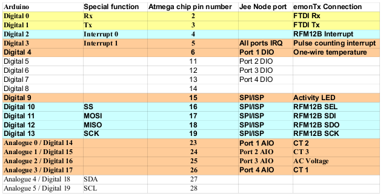

# emonTx V2

**The emonTx V3 has been superseded by the [emonTx V3](https://github.com/openenergymonitor/emontx3)**

***

A a low power wireless energy monitoring node. Powered by an Atmega328 with Arduino bootloader.

It's designed to sense data from up to three CT current sensors, optically from a pulse-output utility meter and monitor temperatures from multiple digital temperature sensors on a one-wire bus. It's designed to be low power and can be powered by 2x AA batteries or 5V USB.

The emonTx is one part of the OpenEnergyMonitor end-to-end web-based energy monitoring system. The other parts being a graphical LCD wireless display (emonGLCD), web connected base station receiver (emonBase / Nanode-RF) and emoncms server based energy visualisation web application.

[http://shop.openenergymonitor.com/emontx-v3/]([http://shop.openenergymonitor.com/sensor-nodes/])

### Schematic

### Board

- PCB: 63.3 mm x 56 mm

### Port Map

### Change log

- V1.0 - first release
- V1.1 - corrected CT circuit error
- V1.2 - complete re-route with GND plate added and signal wires increased to 10mill and power to 16mill. JeeNode offset header - pins changed.
- V1.3 - complete re-route with http://www.freerouting.net/. Reduced vias from 36 to 5!
- V1.4 fixed R9 (one-wire temp) to be pull-up not pull-down
- V1.5 Changed one-wire temperature connection 2.5mm jack-port to enable the use of standard mono 2.5mm jack-plug
- V.2.0 Added another channel to make 3 CT channels. Added option for voltage measurement for real power measurement. Changed to - 3.5mm CT jacks for comparability with seedstudio CT's
- V2.1 - slightly reduce PCB size to fit better into case (63.3x56mm), add voltage selectable jumper (5v3.3V) for pulse IRQ 3.5mm jack digital I/O, add footprint to solder in D18B20 temperature sensor directly onto the board, silkscreen changes including new rear graphics, added top ground plate.
- V2.2 - Added solder jumper to give option to connect temperature sensors to 5V instead of Vcc (3.3V) when emonTx is powered by 5V - USB. Better for multiple sensors and medium/long cable runs
- V2.2.1 11/09/12 - minor silkscreen changes (spelling corrections!), and change "made in UK" to "made in Wales"... :-)

### Open Hardware

Hardware designs (schematics and CAD) files are licensed under the [Creative Commons Attribution-ShareAlike 3.0 Unported License](http://creativecommons.org/licenses/by-sa/3.0/) and follow the terms of the [OSHW (Open-source hardware) Statement of Principles 1.0.](http://freedomdefined.org/OSHW)
